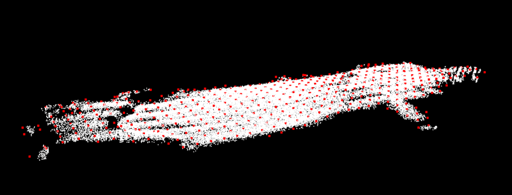
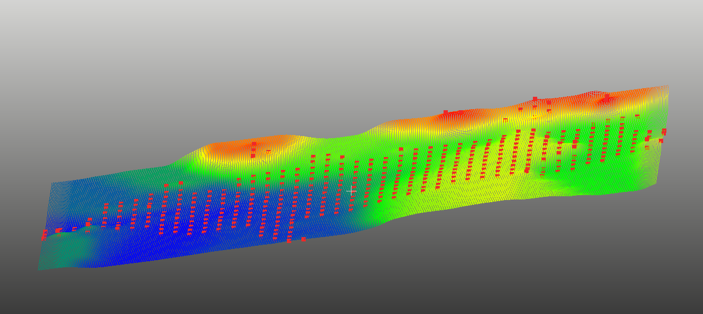

# bspline_surface
A repo. which used to generate 3d surface using bspline.




## Depend
- Eigen/Nanoflann

## Usage
```
git clone "repo"
cd bspline_surface
mkdir build && cd build
cmake ..
make

./bspline_surface <path-to-data>.pcd
```
